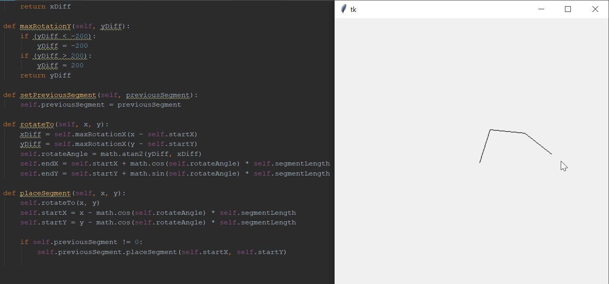

# PyKine by Yacob
### Run instructions:
Extract in a folder \n
Open terminal
Navigate terminal to folder directory (eg: D:\Coding\Workspaces\PythonWorkspace\PyKine)
type "python Main.py"

### Example:
